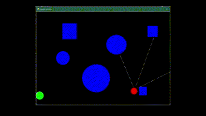

# Obstacle_avoidance_using_RL

## Description
This project focuses on developing an autonomous obstacle avoidance system for mobile robots using reinforcement learning techniques. The primary goal is to enable robots to navigate their environments safely while efficiently avoiding obstacles. The project employs Q-Learning, Deep Q Network (DQN) and Double Deep Q Network (DDQN) algorithms to train agents for optimal decision-making in dynamic environments.

## Key Objectives
- Create an autonomous system for obstacle avoidance in robots (such as autonomous vehicles, drones, and warehouse robots).
- Implement various reinforcement learning algorithms to train agents for decision-making.
- Analyze and compare the performance of Q-Learning, DQN, and DDQN in navigating simulated environments.
- Evaluate the adaptability, robustness, and efficiency of each algorithm in handling dynamic obstacle scenarios.
- Visualization of trained agent behavior in simulated environments.

## Environment

## Results
- Q-Learning
  
When the environment was visualized using the learned policy using Q-Learning, the performance was poor. The agent kept rotating in place until the dynamic obstacle stuck it and the episode ended. This was mainly because the state space was infinitely big and it was impossible to find the optimal Q value for every possible state.

- Deep Q-Learning
  
DQN extends Q-Learning by leveraging deep neural networks to approximate the Q-value function. It's a powerful algorithm, specifically in environments with high-dimensional state spaces such as raw sensor inputs in this case. The integration of neural networks significantly enhanced the capability to handle high-dimensional state spaces. 

- Double Deep Q Learning

## Generalizing to unseen environments

<table>
  <tr>
    <td></td>
    <td></td>
  </tr>
  <tr>
    <td></td>
    <td></td>
  </tr>
</table>

